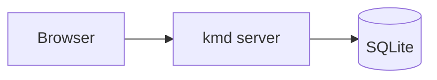

# Architecture

A second fixture document, used to prove that selecting a different file in the
tree renders new content, and that code blocks and diagrams survive rendering.

## Reactive rendering

The client is reactive: signals drive the DOM without a virtual DOM diff.

## A fenced code block

Syntax highlighting is applied server-side by Syntect, so this block must come
back wrapped in a highlight class.

```rust
fn main() {
    let greeting = "hello from the kmd fixture";
    println!("{greeting}");
}
```

## A mermaid diagram

Mermaid blocks are emitted as `class="mermaid"` and rendered client-side.



## Table of contents anchors

### Nested heading one

Content under the first nested heading.

### Nested heading two

Content under the second nested heading.
